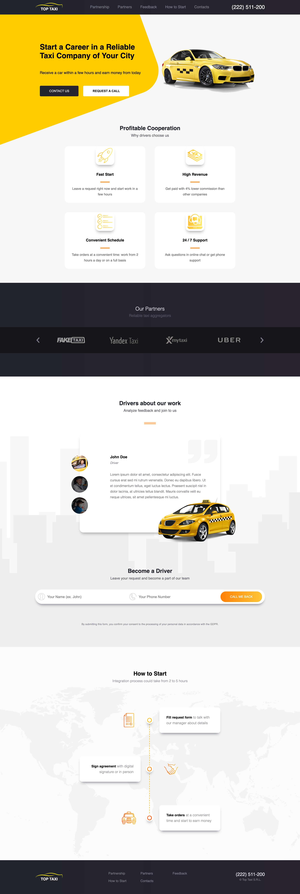

# A Taxi Service website

Built with React.

Features:
1. Responsive Design for Smartphones, Tablets, Desktop
2. Sliders: Reviews and Partners
3. Modal Windows
4. Hamburger Menu on Tablets
5. Contact Forms: Request a Call & Contact us
6. Auto-Copying phone number from Header

For achieving response design was developed a hook that removes elements
directly from DOM depending on window size, avoid using CSS `display: none`.

## Screenshots
1. Desktop:

2. Tablets:
